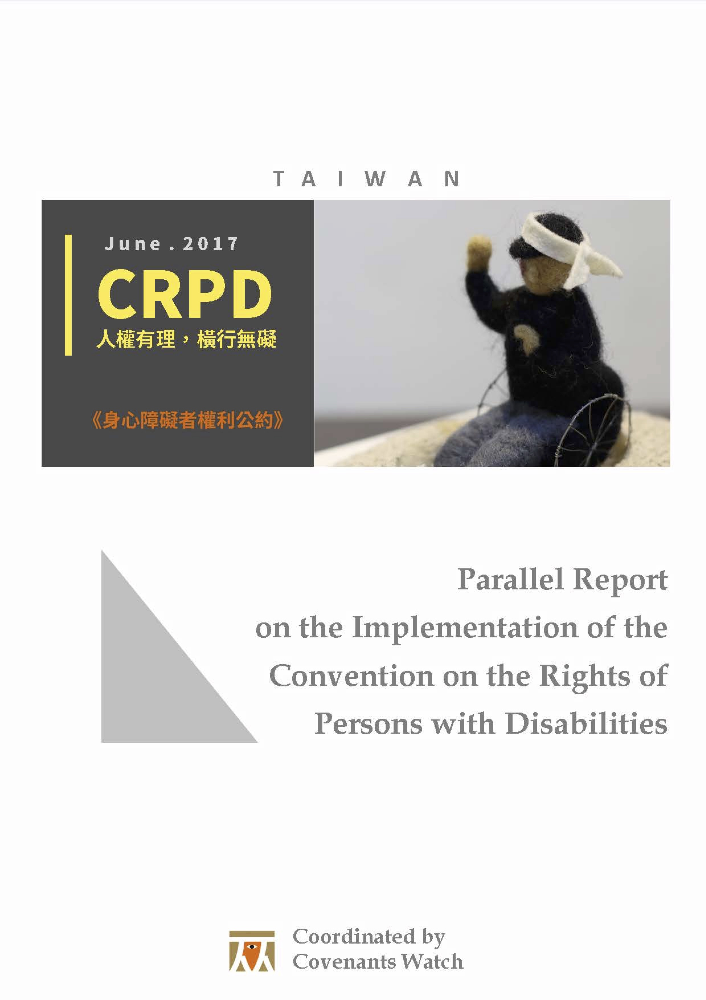

# 2017 Taiwan Parallel Report on the Implementation of the Convention on the Rights of Persons with Disabilities

Covenants Watch was established in December 10, 2009, a member organization composed of human rights groups, human rights workers, lawyers and scholars. Its objective is to monitor the government in fulfillment of its human rights obligations under core United Nations human rights treaties.

Covenants Watch has successfully coordinated a coalition of NGOs (68 NGOs in 2012-2013 and 80 NGOs in 2015-2016) to participate in the shadow reporting in the previous two international reviews of the government’s implementation on the Two Covenants (the International Covenant on Civil and Political Rights and the International Covenant on Economic, Social and Cultural Rights). Based on these experiences, Covenants Watch has organized a series of shadow report writing workshops and CRPD training courses since July 2015. In collaboration with many disability rights movement groups, the workshops aimed to ensure high-quality shadow reports by familiarizing advocates for People with Disabilities with Taiwan’s unique human rights treaty self-review procedures and strengthening their understanding of CRPD.

This report was co-authored by 16 groups, with more than half of them being organizations of persons with disabilities (OPDs). Other organizations include veteran human rights groups engaged in comprehensive human rights issues, judicial reform, promotion of the abolition of the death penalty, prison reform, legal aid, and economic and social rights promotion. This collaboration has contributed to the general human rights organizations’ awareness of the issues faced by People with Disabilities and the strategies used to in rights defense and advocacy. In addition, it allowed for OPDs to gain a deeper understanding of human rights principles and frameworks. For detailed information on participating organizations, please refer to Pages ii-vii.

This report was generated as follows: The topics are first grouped by subject matter and relevance. Group leaders then gather teams to discuss and revise preliminary drafts. Finally, several executive editors reorganize the content to improve the flow between related articles with differing content, thereby making the draft more coherent and consistent. It is worth noting that in order to increase the representation and weight of this report, the responses to each and every provision mentioned have gained the consensus of all participating groups. With regards to issues that have been debated amongst the groups, we have chosen to be frank about our disagreements and have described each stance for the purposes of review by international experts.  One such example is the issue of prenatal screening and rights pertaining to related issues such as advice for abortion due to abnormalities, abortion rights and abortion timeframe. (Please refer to Article 10 of this Report.)

We would like to thank all participating groups for their invaluable contributions, the executive editors, volunteers who have lent their assistance in translating the report, as well as the support for Covenants Watch by many individual donors, for without their help, this report would not have been possible.

**June, 2017**

**Taipei, Taiwan**

## Participating NGOs

- [台灣原住民族政策協會，Association for Taiwan Indigenous Peoples' Policies](http://atipp.blogspot.tw/)
- [人權公約施行監督聯盟，Covenants Watch](http://covenantswatch.org.tw/)
- [台灣身心障礙兒童權利推動聯盟，Disabled Children's Rights Advocacy Alliance in Taiwan](https://www.facebook.com/dcraat.tw/)
- [手天使，Hand Angel](https://www.handjobtw.org/)
- [民間司法改革基金會，Judicial Reform Foundation](https://www.jrf.org.tw)
- [法律扶助基金會，Legal Aid Foundation](http://www.laf.org.tw/)
- LIMA台灣原住民青年團，LIMA Taiwan Indigenous Youth Working Group
- [新北市康復之友協會，New Taipei City Association for Mental Health Survivors (Family Group of People with Mental Illness)](http://www.ntcami.org.tw/ap/index.aspx)
- [台北市新活力自立生活協會，New Vitality Independent Living Association](http://www.ciltp.artcom.tw/ap/index.aspx)
- [台北市行無礙資源推廣協會，Taiwan Access for All Association](http://www.sunable.net/)
- [台灣廢除死刑推動聯盟，Taiwan Alliance to End the Death Penalty](http://www.taedp.org.tw/)
- [台灣障礙者權益促進會，Taiwan Association for Disability Rights](http://www.tadr.org.tw/)
- [台灣人權促進會，Taiwan Association for Human Rights](https://www.tahr.org.tw/)
- [台灣超越巔峰關懷癲癇聯盟，Taiwan Epilepsy Care Alignment](http://epilepsytw.weebly.com/)
- [台灣酷兒權益推動聯盟，Taiwan Gender Queer Rights Advocacy Alliance](http://tgqraa.org/)
- [台灣國際醫學聯盟，Taiwan International Medical Alliance](http://library.taiwanschoolnet.org/diplomacy2006/mdmd/index.htm)
- [台灣監所改革小組，Taiwan Task Force for Prison Reform](http://prisonreform2012.blogspot.tw/)

## Resources

* [PDF](pdf/CRPD_Parallel-Report_CW_072017.pdf)
* [Gitbook](https://www.gitbook.com/book/jrf-tw/taiwan-crpd-parallel-report-2017-en/)

## License

